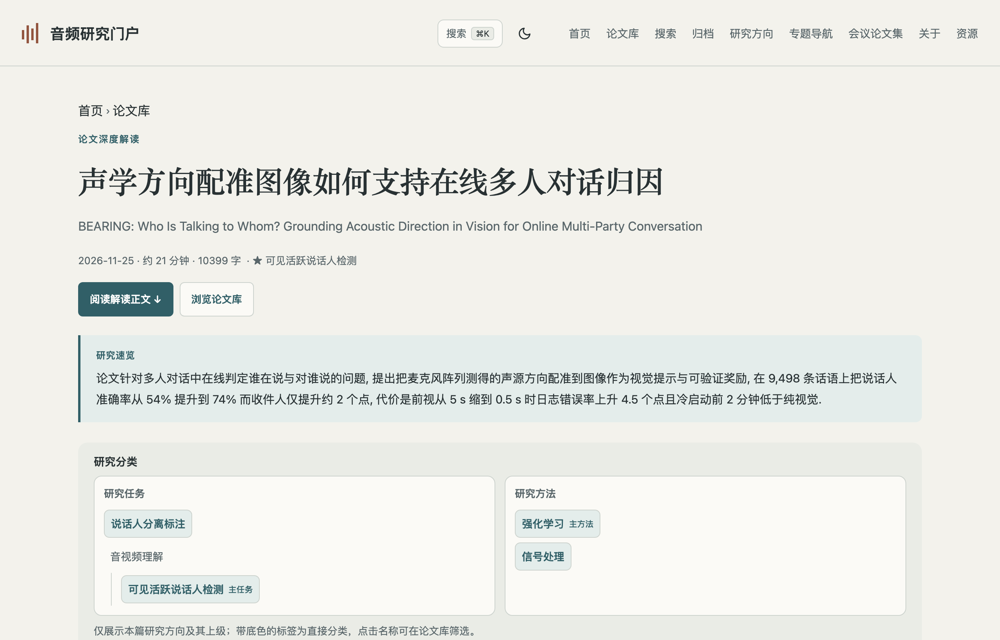
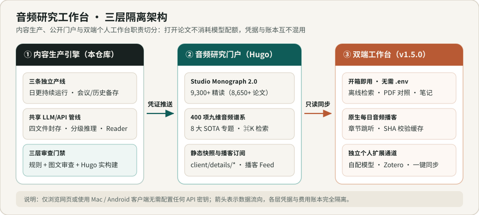

<p align="center">
  
</p>

<p align="center">
  <strong>简体中文</strong> · <a href="README.en.md">English</a> ·
  <a href="https://nanless.github.io/audio-research-portal/">音频研究门户（在线阅读）</a> ·
  <a href="https://github.com/nanless/audio-research-workbench/releases">下载 Mac / Android 客户端</a> ·
  <a href="docs/README.md">文档总索引</a>
</p>

<p align="center">
  <a href="https://nanless.github.io/audio-research-portal/"></a>
  <a href="https://github.com/nanless/audio-research-workbench/releases/tag/v1.5.0"></a>
  
  
  
  <a href="LICENSE"></a>
</p>

<a id="你会得到什么"></a>

语音、音乐、声学与 Audio LLM 方向每天在 arXiv 和顶会涌出几十篇新作——只扫摘要容易漏掉关键约束，逐篇啃原 PDF 又往往耗掉整个上午。**音频研究工作台（Audio Research Workbench）**把日常追踪拆成三个边界清晰的开源组件，让每一处数字、公式与论文原图都可回溯到封存原文：

- **公开知识门户（[音频研究门户 / Audio Research Portal](https://nanless.github.io/audio-research-portal/)）**：采用 **Studio Monograph 2.0** 排版，归档 **9,300+ 篇中文精读（覆盖 8,650+ 篇已核验论文）**、每日研究汇总、19 届顶会专题与 8 大音频 SOTA 方向榜单，支持 `⌘K` 全文检索、原图缩放、表格排序与 Obsidian / BibTeX / RIS 一键导出。
- **双端原生工作台（macOS & Android v1.5.0）**：只读订阅门户静态快照与每日音频播客，提供导读与原 PDF 对照、离线多词检索、按需自配模型追问、Zotero 归档以及坚果云一键双向同步 WebDAV。
- **内容生产引擎（本仓库）**：默认通过语言模型服务（LLM/API）完成抓取去重、筛选、四文件来源封存、深度分析、八维评分、九维分类与面向初学研究者的中文长文（代码中称 **Reader**），全部通过三层审查门禁后才推送发布。

---

## 眼见为实：Studio Monograph 2.0 音频研究门户

<table>
  <tr>
    <td width="50%" valign="top">
      <a href="https://nanless.github.io/audio-research-portal/">
        
      </a>
      <p align="center"><sub><strong>Studio Monograph 2.0 首页</strong> · 最新一期声谱封面与本期选读、<code>⌘K</code> 快速检索及 8 大音频研究专题榜单</sub></p>
    </td>
    <td width="50%" valign="top">
      <a href="https://nanless.github.io/audio-research-portal/">
        
      </a>
      <p align="center"><sub><strong>单篇深度精读页</strong> · 左侧跟随目录、KaTeX 公式与可放大/反色的已核验论文原图、右侧悬浮八维评分环与来源卡</sub></p>
    </td>
  </tr>
</table>

| 常见阅读痛点 | 音频研究工作台的做法 |
|---|---|
| 摘要堆砌术语，看不清方法到底怎样跑通 | 公开 **Reader** 长文控制在 **5,000–18,000 中文字**，直接按具体问题、核心机制与实验发现组织 5–9 节，配结构化实现规格与可选术语桥；13 节内部审计主分析与 Reader 分开保存，互不替代。 |
| 指标幻觉、公式抄错、配图张冠李戴 | 分析前把官方 HTML 与 PDF 封存为四文件并计算 SHA-256；表格逐格回查原文、展示公式由程序写入原 TeX、原图逐张通过图文事实与图号核验。 |
| “开源链接失效”或“篇篇高分” | 逐项探测代码、权重与 Demo 地址，仅实测 `available` 才标为已开源/可用；评分采用 **8 维分类型加权（`type-aware-v2`）** 并由代码重算封顶。 |
| 推送后才发现 404 或排版损坏 | 严格执行 `生成 → 三层审查 → 凭证差异推送 → Pages 部署确认 → 逐页 HTTP 200 与标题核验`，任一环失败均阻断放行。 |

---

## 30 秒找到你的入口

| 你想做什么 | 从这里开始 |
|---|---|
| 在浏览器免费读 9,300+ 篇中文精读与 8 大专题 | 打开 **[音频研究门户](https://nanless.github.io/audio-research-portal/)** · 检索、图注缩放与导出见 [网页阅读工具](docs/blog-reading-tools.md) |
| 在 Mac 上双栏对照原 PDF、记笔记与归档 Zotero | 查看 **[Mac 版使用说明](apps/macos/README.md)**（Apple Silicon，macOS 15+，无需 `.env`） |
| 在 Android 手机 / 平板上离线阅读与听每日播客 | 查看 **[Android 版使用说明](apps/android/README.md)**（Android 9+，全 4 种 ABI） |
| 10 分钟理清来源、分析、门户与客户端的关系 | 阅读 **[项目导读](docs/project-guide.md)** |
| 部署内容生产引擎，运行日更或维护任务 | 完成下方 **[第一次使用](#第一次使用)**，再按 **[操作手册](SKILL.md)** 执行 |

---

## 三层架构与 1.5.0 双端原生工作台



内容生产、公开门户与个人研究彼此隔离：本仓库产出的内容经三层审查按凭证推送至 Hugo 门户（承载 `client/details/*` 内容寻址快照与播客 Feed）；Mac 与 Android 客户端仅只读消费这些静态资产，打开任何论文都不会触发生产模型调用。


| 能力维度 | 音频研究门户（Web） | macOS 工作台（1.5.0） | Android 工作台（1.5.0） |
|---|:---:|:---:|:---:|
| 9,300+ 篇精读、400 项九维分类与评分/开源筛选 | 浏览器即开 + `⌘K` 面板 | 离线快照 + NFKC 多词检索 | 离线快照 + 后台预热 |
| 中文精读与原始 PDF 对照 / 物理页锚定 | 官方原文直达 | AppKit + PDFKit 双栏 | 手机单栏 / 平板并排 |
| 每日音频播客（章节跳听 / `0.75×–2.0×`） | 网页播客播放器 | `AVAudioPlayer` + SHA 缓存 | `MediaPlayer` + SHA 缓存 |
| 排版与图注交互（Studio Monograph 风格） | 1×–6× 原图灯箱 / 表格排序 | 严格白名单净化渲染 | Material 3 紧凑净化渲染 |
| 个人研究追问（自配模型、账单完全隔离） | — | 仅发确认提取文字 | 仅发确认提取文字 |
| Zotero 文献归档（书目 + 导读 + PDF + 笔记） | BibTeX / RIS / Obsidian | 本机 Zotero Desktop API | 官方 Zotero Web API v3 |
| 坚果云 WebDAV 同步与全空间快照备份 | — | 一键双向同步 + 无损合并 / 独立快照 | 一键双向同步 + 无损合并 / 独立快照 |

- **当前公开发行**：Mac 与 Android 均为 **1.5.0（构建号 24）**（2026-11-26 公开发布，来源提交 `5b5a8e79`），新增原生每日音频播客播放器（`150 MiB / 5 期` LRU 缓存，不进备份与同步）、Wave 12 / Track 13.3 视觉排版、NFKC 多词离线检索与筛选对齐，以及“音频研究工作台 / 音频研究门户”品牌迁移（保留 `/audio-paper-digest-blog/` 过渡兼容）。下载与校验见 [GitHub Release v1.5.0](https://github.com/nanless/audio-research-workbench/releases/tag/v1.5.0)、[1.5.0 发版记录](docs/workbench-1.5.0-review.md) 与 [客户端发行核验](docs/client-release-verification.md)。
- **升级提示**：macOS 从 1.4.x 升级后应用包更名为 `音频研究工作台.app`，继续共用 `com.nanless.PaperDigest` 标识、原资料目录与钥匙串（本地 ad-hoc 签名，需 macOS 15+ Apple Silicon），安装后退出并移除旧包即可。Android 沿用 1.4.4+ 签名证书，1.4.4–1.4.7 可直接覆盖升级，1.4.3 须先备份并卸载再安装。

---

<a id="默认行为"></a>
<a id="架构概览"></a>

## 内容生产管线与四项工程保障


内容生产引擎默认使用 **LLM/API 管线**，包含三条独立流程：

| 流程 | 当前状态 | 适用场景与来源边界 | 权威指南 |
|---|---|---|---|
| **当天日更** | **持续运行** | 追踪 arXiv 与 HuggingFace 音频新作；同步门户远端仅按已发布页去重，入选后封存官方 HTML 与 PDF 四文件 | [日更步骤](SKILL.md#1-日更) · [补抓边界](docs/daily-fetch-boundary.md) |
| **官方会议整理** | **暂搁置（2026-11-11 起）** | 梳理 ICML / Interspeech / ICASSP 等官方会议目录与 PDF，实现与测试保持维护 | [会议流程](docs/conference-workflow.md) |
| **历史博客更新** | **暂搁置（2026-11-11 起）** | 按冻结清单从原论文重写旧文章并严格保留原 URL，实现与测试保持维护 | [历史更新](docs/history-rewrite.md) · [历史发布](docs/history-direct-publication.md) |

四项核心保障控制质量与成本：

1. **四文件来源封存**：筛选后、分析前为每篇论文封存 `source.txt`、`source.pdf`、`source-runtime.json`、`source-manifest.json` 并计算 SHA-256，写作、局部修复与冷重放只读这组冻结来源。
2. **按阶段分级推理 + 前缀缓存**：默认启用分级推理（`PD_TIERED_REASONING_EFFORT=1`）与阶段稳定前缀键（`PD_OPENAI_RESPONSES_PROMPT_CACHE_KEY=1`）——主分析与 Reader 长文用 `xhigh`，评分审计与局部修复用 `high`，结构/插图补丁用 `medium`，筛选与发布文本审查用 `low`，机械标签与开源扫描用 `minimal`。
3. **到期优先账号池与不可变账本**：同路由多个 API Key 合并为共享账号池，默认按北京时间月到期日优先、同天选有效剩余月额度最多（且月/周/5 小时三窗口均有额）调度（`PD_LLM_ACCOUNT_POOL_STRATEGY=expiry_priority`，可改 `equal_rotation`），运行时经项目代理自动同步官方 `/zen/go/v1/usage` 实时额度（5 分钟 TTL，可用 `npm run llm:accounts:quota -- sync` 刷新）。仅 429 配额上限或 401 余额不足才同请求换号并冷却，普通 401 立即停产保护在途稿。用量事件默认平铺留账，可按需开启 `PD_LLM_USAGE_SHARD_BY_DATE=1` 按北京时间 `YYYY-MM-DD/` 目录分片，历史账本绝不清零。
4. **三层审查与 SHA 永久复用**：依次通过程序规则、正文与原图审查及 Hugo 实构建；已通过页面按“相对路径 + 内容 SHA”永久复用，重跑只审变动页。

---

<a id="5-分钟开始"></a>
<a id="第一次使用"></a>

## 第一次使用

> 如果你只是阅读文章或使用 Mac / Android 客户端，**跳过这一节**——不需要克隆本仓库，也不需要任何 API 密钥。

面向内容生产维护者的 4 步准备：

1. **核对工作区与角色**：进入 `$HOME/code/github_repos/audio-research-workbench`，核对 `pwd`，执行 `npm run workspace:role -- status` 确认角色为 `daily`（历史命令经 `.env` 中的 `PD_WORKSPACE_ALLOW_CROSS_ROLE=1` 跨角色执行）。
2. **准备运行时与 `.env`**：按 [安装与配置](docs/setup.md) 准备 Node（`>=20.18.1 <21 || >=22.3.0`）、Python 3.11+（`scripts/python-runtime.sh` 优先 `.venv`）与依赖；复制 `env.example` 为 `.env`，填入模型密钥、HTTP CONNECT 代理与本地 `audio-research-portal` 仓库路径。
3. **运行只读体检**：执行 `npm run doctor -- --offline` 与 `npm run config:check`。主模型与可选副模型均按 `scripts/lib/env-schema.js` 校验（现行配置为 `muse-spark-1.3-contributor`，推理上限 `xhigh`；副模型留空只跳过旧版插图补充，不影响 API Reader 图文解读），Muse 与 arXiv 流量强制走项目 HTTP CONNECT 代理。
4. **确认无并发冲突**：确认当前没有其他生成、审查或推送任务在运行，且门户仓库目标日期没有未提交的人工改动。

所有不可绕过的执行红线见 [AGENTS.md](AGENTS.md)，完整演练见 [新人上手](docs/onboarding.md) 与 [操作手册](SKILL.md)。

---

<a id="核心命令"></a>

## 选择任务

日更常用入口速查（执行前替换示例日期与路径）：

| 场景 | 命令与入口 |
|---|---|
| **当天日更** | `npm run digest:prepare -- YYYY-MM-DD`（`digest:api` 为等价别名）；见 [日更步骤](SKILL.md#1-日更) |
| **开跑前体检与探源** | `npm run doctor -- --offline`（加 `--network` 探 arXiv）、`npm run config:check`、`npm run source:probe -- --date YYYY-MM-DD`、`npm run llm:accounts`、`npm run llm:accounts:quota -- sync` |
| **进度监控与记分卡** | `npm run digest:status -- --date YYYY-MM-DD --watch`、`npm run digest:scorecard -- --date YYYY-MM-DD` |
| **失败诊断与补丁清单** | `npm run recover -- --date YYYY-MM-DD`、`npm run manifest:new -- --spec SPEC.json`、`npm run table:check -- --draft FILE` |
| **上线核验与收尾** | `npm run verify:web -- --date DATE --deploy OID`、`npm run publish:finish -- --date DATE` |
| **改动后全仓验收** | `npm run verify`（固定 Hugo 0.160.1 + 语法 + JS/Python 单测 + `docs:check` + `validate:data`） |

<details>
<summary>更多维护与可选命令（会议、历史、重发布、存储压缩、播客）</summary>

| 场景 | 命令与说明 |
|---|---|
| **官方会议整理**（暂搁置） | `conference:acquire` → `conference:discover` → 筛选 → `conference:process`；见 [会议流程](docs/conference-workflow.md) |
| **历史博客原文更新**（暂搁置） | 固定范围后执行 `history:inputs` / `plan` / `sources` / `run` / `aggregate`；见 [历史更新](docs/history-rewrite.md) |
| **历史成果发布**（暂搁置） | `npm run history:publication -- plan\|generate\|review\|publish\|status`；见 [历史发布](docs/history-direct-publication.md) |
| **已发布日批仅更新呈现** | `npm run blog:generate -- --date YYYY-MM-DD --republish UUID`，随后 `blog:review` → `blog:push` |
| **早批次抓取见证登记** | `npm run fetch:witness:prepare -- --date YYYY-MM-DD --source-date YYYY-MM-DD` |
| **影响面预检与误报核对** | `npm run impact -- --git`、`npm run review:overrides -- --date DATE --file F.json` |
| **锁状态、文档与数据校验** | `npm run locks`、`npm run docs:check`、`npm run validate:data` |
| **存储诊断与账本压缩** | `npm run papers:compact`、`npm run storage:pdf-dedupe`、`npm run storage:report`、`npm run storage:prune` |
| **可选工具：分数校准 / 每日播客** | `npm run digest:calibrate -- --dry-run`、`npm run podcast:generate -- --date YYYY-MM-DD --dry-run` |

</details>

---

## 运行一次日更

把日期替换为**北京时间当天**：

```bash
npm run digest:prepare -- YYYY-MM-DD
```

程序依次执行：同步门户远端 → 边界补抓并按已发布页去重 → 关键词预筛与模型筛选 → 封存每篇官方 HTML 与 PDF → 多阶段深度分析、八维评分、九维分类与 Reader 长文写作 → 生成页面并通过三层审查 → 精确差异推送并登记本次不生图。推送完成后，继续确认 GitHub Pages 部署成功并逐页完成网页核验。

三条硬边界请提前知晓：

- **默认不生图**：按 2026-11-02 起的持续要求，日更不再生成论文长图与汇总封面（旧 `--no-visuals` 参数仍兼容），推送后自动登记不生图记录；论文原图照常拉取、展示和审查。登记异常见 [排障说明](docs/troubleshooting.md#11-不生图登记失败)。
- **历史日期不能从日更抓取阶段重跑**：新抓取严格绑定北京时间当天；历史日期仅可沿用受控来源从 `--from generate|review|push|visual` 续跑，或走历史更新流程（见 [补抓边界](docs/daily-fetch-boundary.md)）。
- **只按已发布页去重**：此前落选或未发布的论文不会因进入过候选列表而被跳过，后续仍可正常补更。

---

## 失败后从哪里继续

遇到单篇失败时，**先跑完本轮全部其余论文并落盘**，再仅对可重试失败集合续跑。所有已通过的来源、阶段检查点、草稿、历史计数与费用账本均完整保留，绝不推倒重来或清零记账。

| 中断位置 | 推荐恢复入口 |
|---|---|
| 日更分析或 Reader 长文 | `npm run deep`、`npm run batch` 或 `npm run api:reader:refresh`（只读同一组封存四文件） |
| 官方会议处理或页面维护 | 续跑原 `conference:process` / `conference:migrate-process`；见 [会议恢复](docs/conference-workflow.md#已有完整会议只更新页面) |
| 历史准备或分析 | 继续原计划与 `npm run history:run`；暂停任务用 `npm run history:resume` 恢复 |
| 博客正文或图片审查拒稿 | 先跑完整批审查；正文走正常 Reader 维护，图片可先派发同篇认证 PDF 出版视图后重审 |
| 认证、余额、配置或保存异常 | 立即停止新派发、保全在途稿并排除故障（多号池逐号独立探测），修复后从原阶段续跑 |

多轮自动恢复后若仅剩少量顽固项，可使用来源绑定的受控人工修正清单（每篇限定 1–8 个已有节点，修正后仍须通过完整资格与博客审查，详见 [解读恢复](docs/reader-explicit-retry.md)）。有助于提升效率与成稿质量的必要后续付费窗口已获 [持续授权](AGENTS.md#持续授权以效率和效果为准)，按实际进度单独记账即可。

> **旧链退役说明**：整批 Manual 写作与微信、飞书、小红书发布已退役。[manual/README.md](manual/README.md) 仅保留旧记录核验及独立人工审查（新独立审查使用 `gpt-6.1-sol/high` 并登记真实身份）。

---

## 怎样才算完成

一次日更必须同时满足 [AGENTS.md 的六项完成标准](AGENTS.md#日更完成的六项) 才可宣告上线：

1. **数据与来源**：正式分析、封存来源、Reader 长文、八维评分与九维标签通过当前检查。
2. **审查**：最终页面通过规则、正文、原图及 Hugo 实构建审查，审查凭证覆盖完整目标集合。
3. **远端发布**：仅推送凭证允许的精确差异，并核对远端 `main` 提交 OID 一致。
4. **部署**：对应发布提交（或保留本批已审字节的后续提交）的 GitHub Pages `build` 与 `deploy` 均成功。
5. **网页核验**：逐页核验汇总页与单篇的 HTTP 200、正式地址与准确标题（`npm run verify:web`），并保存核验记录。
6. **不生图登记与重读状态**：与当前发布绑定的不生图记录有效，最后重跑 `npm run digest:status -- --date YYYY-MM-DD` 复核。

`digest:status` 只反映读取瞬间的本地与发布快照，不能替代第 4、5 项的真实部署与在线网页核验。

---

## 仓库结构

```text
audio-research-workbench/
├── scripts/               # 内容生产核心引擎（抓取、筛选、封存、分析、评分、Reader、审查、推送、播客）
│   └── lib/               # 公共库：LLM 路由/缓存/账号池、来源验证、SVG/PDF 处理、锁与成本账本
├── prompts/current/       # 现行阶段提示词模板（附历史 Git blob 指纹冷重放索引）
├── config/                # 400 项九维分类词表、协议目录（clients*.json）、工作区角色与历史见证
├── apps/
│   ├── macos/             # macOS 原生音频研究工作台（Swift / AppKit / WebKit / PDFKit / AVAudioPlayer）
│   └── android/           # Android 原生音频研究工作台（Kotlin / Jetpack Compose / 原子 JSON 存储 + PDFBox / WorkManager）
├── web/tag-explorer/      # 离线 400 项九维分类体系浏览器静态前端（配合 npm run tags:serve）
├── prototypes/macos-research/ # 客户端离线 PDF/图注原型及已入库的 MiCLA 测试资产
├── docs/                  # 架构、数据合同、操作指南、客户端验收与 Studio Monograph 双语示意图（docs/images/）
├── skills/                # 可复用的清晰技术写作与工程操作 Skill
├── manual/                # 已退役整批 Manual 的只读历史核验与单篇独立人工审查入口
└── tests/                 # Node.js + Python 自动化回归测试套件（含离线契约与冷重放测试）
```

---

## 文档导航

- **[项目导读](docs/project-guide.md)**：10 分钟看懂论文来源、分析引擎、音频研究门户与双端客户端的关系。
- **[操作手册](SKILL.md)** 与 **[执行规则 AGENTS.md](AGENTS.md)**：按步骤操作指南、失败恢复与不可绕过的约束红线。
- **[文档总索引](docs/README.md)**：按任务快速定位环境配置、来源边界、九维分类、云同步与故障排查。
- **[脚本指南](scripts/README.md)** 与 **[完整脚本索引](scripts/INDEX.md)**：查阅每个 CLI 入口、共享核心库与兼容模块。
- **[客户端发行核验](docs/client-release-verification.md)**：Mac 与 Android 安装包签名、证书、12 件附件与 SHA-256 核验记录。
- **[把技术写清楚](skills/clear-technical-writing/SKILL.md)** 与 **[项目写作约定](docs/writing-guide.md)**：面向初学者的清晰写作、术语统一与配图规范。
